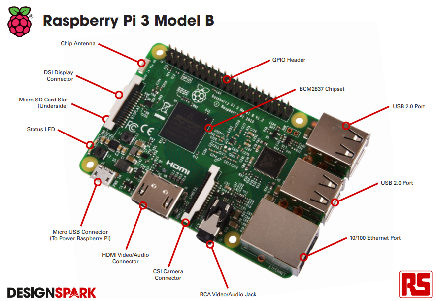
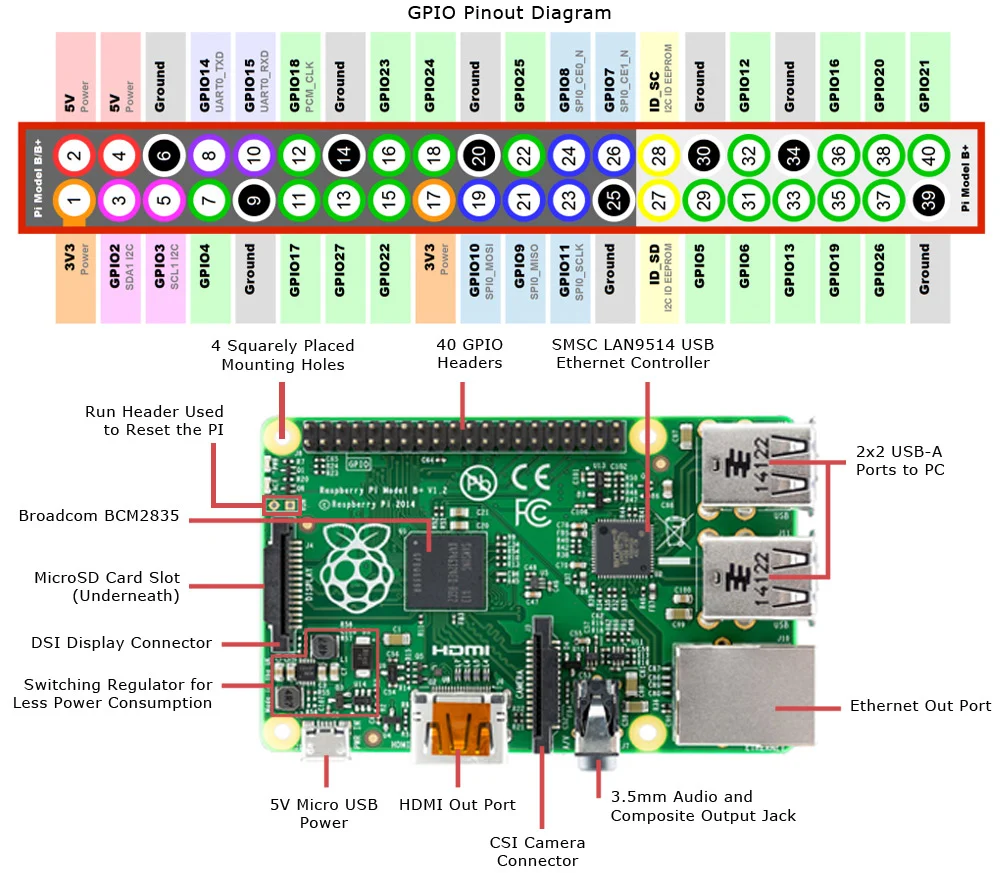
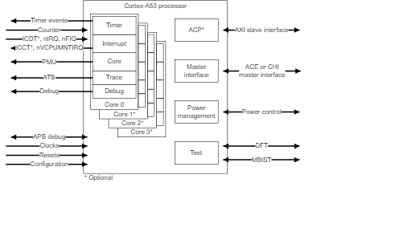
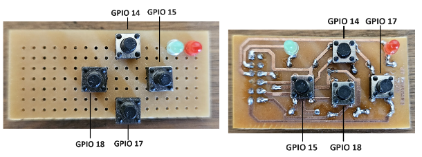
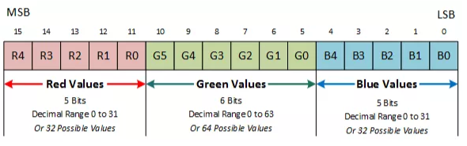

# AC-II

## Index

1. [Specifications](#specifications)
   - [Pin-out](#pin-out)
2. [Proccessor](#proccessor)
   - [Memory map](#memorymap)
   - [Framebuffer](#framebuffer)
   - [GPIO](#gpio)
3. [Project](#project)
   - [Exercise 1](#exercise-1)
   - [Exercise 2](#exercise-2)
   - [Template](#template)

## Specifications



- Model: Raspberry Pi 3B V1.2
- CPU: Quad Core 1.2GHz Broadcom **BCM2837** 64bit(ARM Cortex-A53)
- GPU: Dual Core VideoCore IV® Multimedia Co-Processor. Provides Open GL
  ES 2.0, hardware-accelerated OpenVG, and 1080p30 H.264 high-profile
  decode.
- Memory: 1GB LPDDR2
- Boots from Micro SD card
- Connectors:
  - Ethernet: 10/100 BaseT Ethernet socket
  - Connector: 40-pin 2.54 mm (100 mil) expansion header: 2x20 strip. Providing 27 GPIO pins as well as +3.3 V, +5 V and GND supply lines
  - 4 USB 2 ports
  - 4 Pole stereo output and composite video port

### Pin-out



## Proccessor

The Cortex-A53 processorimplements the Armv8-A architecture. The Cortex-A53 processor has one to four cores, each with an L1 memory system and a single shared L2 cache.



Features include:

- Support for both AArch32 and AArch64 Execution states.
- Support for all Exception levels, EL0, EL1, EL2, and EL3, in each execution state.
- The A32 instruction set, previously called the Arm instruction set.
- The T32 instruction set, previously called the Thumb instruction set.
- The A64 instruction set.

### MemoryMap

The processor has a 32 bit address lenght, so it has 4GB of addressable space (2^32).

| Address                    |           Device           | Description                                                                                                                                                                                    |
| -------------------------- | :------------------------: | :--------------------------------------------------------------------------------------------------------------------------------------------------------------------------------------------- |
| 0x0000_0000 .. 0x3FFF_FFFF |         GPU access         | Shared memory between CPU and GPU.                                                                                                                                                             |
| 0x3E00_0000 .. 0x3FFF_FFFF |   GPU peripheral access    | Dedicated to the interaction of GPU with periphericals as video controllers, O/I graphic interface and more.                                                                                   |
| 0x4000_0000 .. 0x4001_FFFF | ARM timer, IRQs, mailboxes | This is a subsection within the local peripherals containing specific ARM core timers, interrupt request controllers (IRQs), and the mailboxes used for communication between the CPU and GPU. |
| 0x4002_0000 .. 0x4002_FFFF |         Debug ROM          | This range is reserved for the debug ROM.                                                                                                                                                      |
| 0x4003_0000 .. 0x4003_FFFF |            DAP             | Interface used to access the ARM architecture's debugging capabilities.                                                                                                                        |
| 0x4004_0000 .. 0xFFFF_FFFF |           Unused           | -                                                                                                                                                                                              |

### Framebuffer

In general terms, a framebuffer refers to the method used by graphic devices in a computer system, where each pixel on the screen is represented by a specific location in the RAM (main system memory).

The processor this method through its Video Core (VC). To use it, the Video Core must first be initialized via a service that facilitates communication between the CPU and the VC, called the mailbox.

A mailbox consists of one or more registers located at specific addresses in the memory map (in the peripheral zone) whose content is sent to the corresponding control/status registers of a system peripheral.

This method simplifies hardware initialization tasks (written in low-level code) before the operating system is loaded.

### GPIO

The GPIO peripheral has three dedicated interrupt lines. These lines are triggered by the
setting of bits in the event detect status register. Each bank has its’ own interrupt line with the
third line shared between all bits.

The Alternate function table also has the pull state (pull-up/pull-down) which is applied after
a power down.

#### GPIO Register

All accesses are assumed to be 32-bit

|   Address   |  Field Name  |              Description              | Size | Read/Write |
| :---------: | :----------: | :-----------------------------------: | :--: | :--------: |
| 0x3F20 0000 |   GPFSEL0    |        GPIO Function Select 0         |  32  |    R/W     |
| 0x3F20 0004 |   GPFSEL1    |        GPIO Function Select 1         |  32  |    R/W     |
| 0x3F20 0008 |   GPFSEL2    |        GPIO Function Select 2         |  32  |    R/W     |
| 0x3F20 000C |   GPFSEL3    |        GPIO Function Select 3         |  32  |    R/W     |
| 0x3F20 0010 |   GPFSEL4    |        GPIO Function Select 4         |  32  |    R/W     |
| 0x3F20 0014 |   GPFSEL5    |        GPIO Function Select 5         |  32  |    R/W     |
| 0x3F20 0018 | - Reserved - |                   -                   |  -   |     -      |
| 0x3F20 001C |    GPSET0    |         GPIO Pin Output Set 0         |  32  |     W      |
| 0x3F20 0020 |    GPSET1    |         GPIO Pin Output Set 1         |  32  |     W      |
| 0x3F20 0024 | - Reserved - |                   -                   |  -   |     -      |
| 0x3F20 0028 |    GPCLR0    |        GPIO Pin Output Clear 0        |  32  |     W      |
| 0x3F20 002C |    GPCLR1    |        GPIO Pin Output Clear 1        |  32  |     W      |
| 0x3F20 0030 | - Reserved - |                   -                   |  -   |     -      |
| 0x3F20 0034 |    GPLEV0    |           GPIO Pin Level 0            |  32  |     R      |
| 0x3F20 0038 |    GPLEV1    |           GPIO Pin Level 1            |  32  |     R      |
| 0x3F20 003C | - Reserved - |                   -                   |  -   |     -      |
| 0x3F20 0040 |    GPEDS0    |    GPIO Pin Event Detect Status 0     |  32  |    R/W     |
| 0x3F20 0044 |    GPEDS1    |    GPIO Pin Event Detect Status 1     |  32  |    R/W     |
| 0x3F20 0048 | - Reserved - |                   -                   |  -   |     -      |
| 0x3F20 004C |    GPREN0    | GPIO Pin Rising Edge Detect Enable 0  |  32  |    R/W     |
| 0x3F20 0050 |    GPREN1    | GPIO Pin Rising Edge Detect Enable 1  |  32  |    R/W     |
| 0x3F20 0054 | - Reserved - |                   -                   |  -   |     -      |
| 0x3F20 0058 |    GPFEN0    | GPIO Pin Falling Edge Detect Enable 0 |  32  |    R/W     |
| 0x3F20 005C |    GPFEN1    | GPIO Pin Falling Edge Detect Enable 1 |  32  |    R/W     |
| 0x3F20 0060 | - Reserved - |                   -                   |  -   |     -      |
| 0x3F20 0064 |    GPHEN0    |     GPIO Pin High Detect Enable 0     |  32  |    R/W     |
| 0x3F20 0068 |    GPHEN1    |     GPIO Pin High Detect Enable 1     |  32  |    R/W     |
| 0x3F20 006C | - Reserved - |                   -                   |  -   |     -      |
| 0x3F20 0070 |    GPLEN0    |     GPIO Pin Low Detect Enable 0      |  32  |    R/W     |
| 0x3F20 0074 |    GPLEN1    |     GPIO Pin Low Detect Enable 1      |  32  |    R/W     |
| 0x3F20 0078 | - Reserved - |                   -                   |  -   |     -      |
| 0x3F20 007C |   GPAREN0    | GPIO Pin Async. Rising Edge Detect 0  |  32  |    R/W     |
| 0x3F20 0080 |   GPAREN1    | GPIO Pin Async. Rising Edge Detect 1  |  32  |    R/W     |
| 0x3F20 0084 | - Reserved - |                   -                   |  -   |     -      |
| 0x3F20 0088 |   GPAFEN0    | GPIO Pin Async. Falling Edge Detect 0 |  32  |    R/W     |
| 0x3F20 008C |   GPAFEN1    | GPIO Pin Async. Falling Edge Detect 1 |  32  |    R/W     |
| 0x3F20 0090 | - Reserved - |                   -                   |  -   |     -      |
| 0x3F20 0094 |    GPPUD     |     GPIO Pin Pull-up/down Enable      |  32  |    R/W     |
| 0x3F20 0098 |  GPPUDCLK0   | GPIO Pin Pull-up/down Enable Clock 0  |  32  |    R/W     |
| 0x3F20 009C |  GPPUDCLK1   | GPIO Pin Pull-up/down Enable Clock 1  |  32  |    R/W     |
| 0x3F20 00A0 | - Reserved - |                   -                   |  -   |     -      |
| 0x3F20 00B0 |    - Test    |                   4                   | R/W  |

#### Function Select Registers (GPFSELn)

The function select registers are used to define the operation of the general-purpose I/O
pins. Each of the 54 GPIO pins has at least two alternative functions as defined in section
16.2. The FSEL{n} field determines the functionality of the nth GPIO pin. All unused
alternative function lines are tied to ground and will output a “0” if selected. All pins reset
to normal GPIO input operation.

| Bit(s) | Field Name | Description                                 | Type | Reset |
| ------ | ---------- | ------------------------------------------- | ---- | ----- |
| 31-30  | ---        | Reserved                                    | R    | 0     |
| 29-27  | FSEL9      | FSEL9 - Function Select 9                   | R/W  | 0     |
|        |            | 000 = GPIO Pin 9 is an input                |      |       |
|        |            | 001 = GPIO Pin 9 is an output               |      |       |
|        |            | 100 = GPIO Pin 9 takes alternate function 0 |      |       |
|        |            | 101 = GPIO Pin 9 takes alternate function 1 |      |       |
|        |            | 110 = GPIO Pin 9 takes alternate function 2 |      |       |
|        |            | 111 = GPIO Pin 9 takes alternate function 3 |      |       |
|        |            | 011 = GPIO Pin 9 takes alternate function 4 |      |       |
|        |            | 010 = GPIO Pin 9 takes alternate function 5 |      |       |
| 26-24  | FSEL8      | FSEL8 - Function Select 8                   | R/W  | 0     |
| 23-21  | FSEL7      | FSEL7 - Function Select 7                   | R/W  | 0     |
| 20-18  | FSEL6      | FSEL6 - Function Select 6                   | R/W  | 0     |
| 17-15  | FSEL5      | FSEL5 - Function Select 5                   | R/W  | 0     |
| 14-12  | FSEL4      | FSEL4 - Function Select 4                   | R/W  | 0     |
| 11-9   | FSEL3      | FSEL3 - Function Select 3                   | R/W  | 0     |
| 8-6    | FSEL2      | FSEL2 - Function Select 2                   | R/W  | 0     |
| 5-3    | FSEL1      | FSEL1 - Function Select 1                   | R/W  | 0     |
| 2-0    | FSEL0      | FSEL0 - Function Select 0                   | R/W  | 0     |

> GPIO Alternate function select register 0

| Bit(s) | Field Name | Description                                  | Type | Reset |
| ------ | ---------- | -------------------------------------------- | ---- | ----- |
| 31-30  | ---        | Reserved                                     | R    | 0     |
| 29-27  | FSEL19     | FSEL19 - Function Select 19                  | R/W  | 0     |
|        |            | 000 = GPIO Pin 19 is an input                |      |       |
|        |            | 001 = GPIO Pin 19 is an output               |      |       |
|        |            | 100 = GPIO Pin 19 takes alternate function 0 |      |       |
|        |            | 101 = GPIO Pin 19 takes alternate function 1 |      |       |
|        |            | 110 = GPIO Pin 19 takes alternate function 2 |      |       |
|        |            | 111 = GPIO Pin 19 takes alternate function 3 |      |       |
|        |            | 011 = GPIO Pin 19 takes alternate function 4 |      |       |
|        |            | 010 = GPIO Pin 19 takes alternate function 5 |      |       |
| 26-24  | FSEL18     | FSEL18 - Function Select 18                  | R/W  | 0     |
| 23-21  | FSEL17     | FSEL17 - Function Select 17                  | R/W  | 0     |
| 20-18  | FSEL16     | FSEL16 - Function Select 16                  | R/W  | 0     |
| 17-15  | FSEL15     | FSEL15 - Function Select 15                  | R/W  | 0     |
| 14-12  | FSEL14     | FSEL14 - Function Select 14                  | R/W  | 0     |
| 11-9   | FSEL13     | FSEL13 - Function Select 13                  | R/W  | 0     |
| 8-6    | FSEL12     | FSEL12 - Function Select 12                  | R/W  | 0     |
| 5-3    | FSEL11     | FSEL11 - Function Select 11                  | R/W  | 0     |
| 2-0    | FSEL10     | FSEL10 - Function Select 10                  | R/W  | 0     |

> GPIO Alternate function select register 1

#### Pin Output Set Registers (GPSETn)

The output set registers are used to set a GPIO pin. The SET{n} field defines the
respective GPIO pin to set, writing a “0” to the field has no effect. If the GPIO pin is
being used as in input (by default) then the value in the SET{n} field is ignored.
However, if the pin is subsequently defined as an output then the bit will be set
according to the last set/clear operation. Separating the set and clear functions
removes the need for read-modify-write operations

| Bit(s) | Field Name     | Description        | Type | Reset |
| ------ | -------------- | ------------------ | ---- | ----- |
| 31-0   | SETn (n=0..31) | 0 = No effect      | R/W  | 0     |
|        |                | 1 = Set GPIO pin n |      |       |

#### Pin Output Clear Registers (GPCLRn)

The output clear registers) are used to clear a GPIO pin. The CLR{n} field defines
the respective GPIO pin to clear, writing a “0” to the field has no effect. If the GPIO
pin is being used as in input (by default) then the value in the CLR{n} field is
ignored. However, if the pin is subsequently defined as an output then the bit will
be set according to the last set/clear operation. Separating the set and clear
functions removes the need for read-modify-write operations

| Bit(s) | Field Name     | Description          | Type | Reset |
| ------ | -------------- | -------------------- | ---- | ----- |
| 31-0   | CLRn (n=0..31) | 0 = No effect        | R/W  | 0     |
|        |                | 1 = Clear GPIO pin n |      |       |

#### Pin Level Registers (GPLEVn)

The pin level registers return the actual value of the pin. The LEV{n} field gives the
value of the respective GPIO pin.

| Bit(s) | Field Name     | Description            | Type | Reset |
| ------ | -------------- | ---------------------- | ---- | ----- |
| 31-0   | LEVn (n=0..31) | 0 = GPIO pin n is low  | R/W  | 0     |
|        |                | 1 = GPIO pin n is high |      |       |

#### Example

● GPIO 2: 0000 0000 0000 0000 0000 0000 0000 0100 = 0x00000004
● GPIO 3: 0000 0000 0000 0000 0000 0000 0000 1000 = 0x00000008
● GPIO 2 y 3: 0000 0000 0000 0000 0000 0000 0000 1100 = 0x0000000C

## Project

### Exercise-1

Write a program in ARMv8 assembly based on the given example code that generates a static image on the screen that closely resembles the following:


#### Minimum Conditions

- The image must use the full screen size (512x512 pixels).
- The shapes must be created from the generated code. It is desirable to model procedures for each operation (draw, fill, erase, etc.) or shapes (circle, rectangle, triangle, etc.) and then use them. It is not allowed to store a shape in memory and load it onto the screen by code.
- Approximate the colors of the character and the background as closely as possible.

### Exercise-2

Write a program in ARMv8 assembly based on the given example code that generates a maze occupying the entire screen and a player that moves up, down, left, and right when the corresponding button is pressed (see GPIO mapping in the figure).

Use LEDs to indicate events in the game. For example, when starting the game, turn on the red LED (GPIO3) and keep it on until the maze is completed. When the goal is reached, turn on the green LED (GPIO2) for a few seconds.



#### Conditions that the exercise must meet

- The complete route of the maze (from the start to the goal) must require multiple changes of direction. It will be positively evaluated for promotion that the background of the maze (where the player moves) is not smooth.
- Use at least 3 different colors.

### Template

The project template consists of several assembly files and a makefile used for setting up a framebuffer, handling GPIO input, and drawing pixels on the screen. Below is a brief overview of each component included in the template:

1. [main.s](#main)
2. [gpio.s](#gpio-s)
3. [memmap](#memmap)
4. [Makefile](#makefile)

---

#### main

Initializes the framebuffer and handles the overall program flow.

> X0 contain the base address of the framebuffer(pixel 1)

##### Directives

Directives are special instructions that provide guidance to the assembler on how to process the source code. Unlike regular assembly instructions, which are executed by the CPU, directives are not directly translated into machine code. Instead, they control the assembly process, defining how the program is organized and how data is handled.

```as
.text // Indicates that the subsequent code is part of the executable section
.org 0x0000 // Memory address begin at 0x0000.
```

##### Define variables

Define the width and height in pixels and specifies the color on 16 bits RGB format.

```as
.equ SCREEN_X, 512
.equ SCREEN_Y, 512
.equ BITS_PER_PIXEL, 16
```

> The .eque instruction assigns absolute or relocatable values to symbols



The color of the pixel will be the result of the additive combination of the three colors (red, green, and blue). Thus, the color black is represented by the value 0x0000, white by 0xFFFF, red by 0xF800, green by 0x07E0, and blue by 0x001F.

##### CPU core

Obtein and use the id of the cpu core in wich the code is executing

```as
mrs x0,MPIDR_EL1 // X0 = Multiprocessor Affinity Register (MPIDR)
ands x0,x0,3 // X0 = CPU ID (Bits 0..1)
b.ne CoreLoop // IF (CPU ID != 0) Branch To Infinite Loop (Core ID 1..3)
```

> MRS moves the value from the selected special-purpose register into a general-purpose register.

##### Framebuffer initialization

Initializes the framebuffeusing a mailbox to communicate with the graphics hardware. It sets the framebuffer pointer and converts it to a physical address before jumping to the main application. Additionally, an infinite loop is established for the additional cores, which are likely idle while waiting for tasks. The mailbox structure is configured to handle the properties of the framebuffer.

#### GPIO-s

Reads the state of a button connected to GPIO17. It loads the state of all GPIO pins into the x22 register, isolates the state of GPIO17, and finally returns to the instruction that called inputRead.

This declares that the label inputRead is accessible from other assembly files or modules

```as
.global inputRead
```

```as
inputRead:
  ldr w22, [x20, GPIO_GPLEV0] // Load GPIO Pin Level 0 register into X22
  and X22,X22,#0x20000 // Load GPIO Pin Level 0 register into X22

  br x30
```

#### MemMap

- MEMORY: Defines the available memory, in this case, 4 MB of RAM starting at 0x0000.
- SECTIONS: Organizes the program into different sections:
- .text: Contains the executable code.
- .bss: Contains uninitialized variables.

```as
MEMORY
{
    ram : ORIGIN = 0x0000, LENGTH = 0x400000
}

SECTIONS
{
    .text : { *(.text*) } > ram
    .bss : { *(.bss*) } > ram
}
```

#### Makefile

Set up for assembling and linking project, managing object files and generating outputs.

```Makefile
ARMGNU ?= aarch64-linux-gnu

AOPS = --warn --fatal-warnings

asm : build/kernel.img

all : asm

clean :
    rm -f build/*.o
    rm -f build/*.img
    rm -f build/*.hex
    rm -f build/*.elf
    rm -f build/*.list
    rm -f build/*.img
    rm -f build/memory_map.txt

build/main.o : main.s
    $(ARMGNU)-as $(AOPS) main.s gpio.s app.s -o build/main.o

build/kernel.img : memmap build/main.o
    $(ARMGNU)-ld build/main.o -T memmap -o build/main.elf -M > build/memory_map.txt
    $(ARMGNU)-objdump -D build/main.elf > build/main.list
    $(ARMGNU)-objcopy build/main.elf -O ihex build/main.hex
    $(ARMGNU)-objcopy build/main.elf -O binary build/kernel8.img
```

#### App

The example code fills the entire screen with RED color. Then it reads the input from GPIO17; if the button is released (IN=0V), the screen turns BLUE, and if it is pressed (IN=3.3V), the screen turns GREEN.

```as
.globl app
app:
    //---------------- Inicialización GPIO --------------------

    mov w20, PERIPHERAL_BASE + GPIO_BASE     // Dirección de los GPIO.

    // Configurar GPIO 17 como input:
    mov X21,#0
    str w21,[x20,GPIO_GPFSEL1] 		// Coloco 0 en Function Select 1 (base + 4)

    //---------------- Main code --------------------
    // X0 contiene la dirección base del framebuffer (NO MODIFICAR)

    mov w3, 0xF800    	// 0xF800 = ROJO
    add x10, x0, 0		// X10 contiene la dirección base del framebuffer
loop2:
    mov x2,512         	// Tamaño en Y
loop1:
    mov x1,512         	// Tamaño en X
loop0:
    sturh w3,[x10]	   	// Setear el color del pixel N
    add x10,x10,2	   	// Siguiente pixel
    sub x1,x1,1	   		// Decrementar el contador X
    cbnz x1,loop0	   	// Si no terminó la fila, saltar
    sub x2,x2,1	   		// Decrementar el contador Y
    cbnz x2,loop1	  	// Si no es la última fila, saltar

    // --- Delay loop ---
    movz x11, 0x10, lsl #16
delay1:
    sub x11,x11,#1
    cbnz x11, delay1
    // ------------------

    bl inputRead		// Leo el GPIO17 y lo guardo en x21
    mov w3, 0x001F    	// 0x001F = AZUL
    add x10, x0, 0		// X10 contiene la dirección base del framebuffer
    cbz X22, loop2
    mov w3, 0x07E0    	// 0x07E0 = VERDE
    b loop2

    // --- Infinite Loop ---
InfLoop:
    b InfLoop
```
